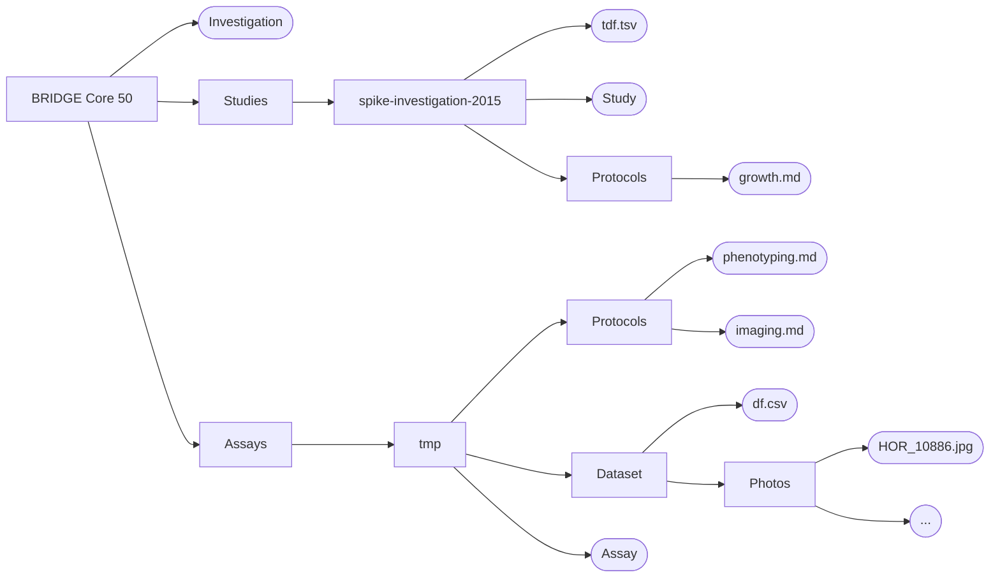
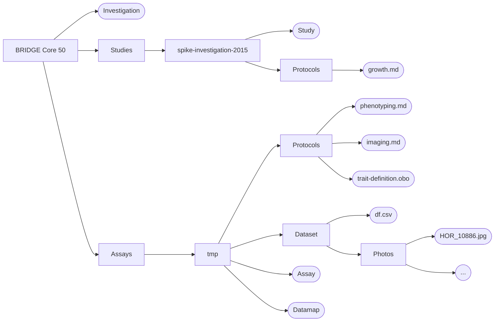

# Fragment-Level FAIRness
## Machine-actionable Plant Phenomics

  

    

      
      Interoperability & Standards
    

  

<v-clicks>

- **Fragment selector**: Precisely identify and reference specific parts of a dataset rather than just the whole file
  - e.g. single values, rows or columns
  - Enables fine-grained annotation, citation and reuse of data fragments

- **Data map**: Structured overview of the dataset, describing how each fragment is organized, what it represents, and how it can be accessed
  - Make it easier for both humans and machines to discover, interpret, and connect relevant data fragments.

- Together, fragment selectors and data maps enable machine-actionable, context-rich access to plant phenomics data

</v-clicks>

---

  

    

      
      Interoperability & Standards
    

  

| **Plant**       | **TKW** | **PH** | **FT** | **PM** |
|-----------------|---------|--------|--------|--------|
| Barke           | 48.2    | 95     | 62     | 2      |
| Morex           | 45.7    | 102    | 65     | 3      |
| Golden Promise  | 43.5    | 88     | 60     | 4      |
| Scarlett        | 47.1    | 97     | 63     | 2      |
| Steptoe         | 44.8    | 100    | 67     | 5      |

<v-click>
  <FancyArrow from="(700, 80)" to="(850, 130)" arc="0.25" color="yellow"/>
  

    Powdery Mildew Susceptibility?
    Photosynthetic Mass?
    Plant Maturity?
  

</v-click>

<v-click>
  <FancyArrow from="(700, 450)" to="(770, 300)" arc="0.25" color="red"/>
  

    What does this mean?
    Relative to sowing date?
    Relative to January 1st?
  

</v-click>

<v-click>
  <FancyArrow from="(500, 200)" to="(280, 135)" arc="-0.25" color="blue"/>
  

    Those are varieties?!
    What samples are meant?
    Where can I find metadata?
  

</v-click>

---

| **Plant**       | **Trait** | **Value** |
|-----------------|-----------|-----------|
| Barke           | TKW       | 48.2      |
| Barke           | PH        | 95        |
| Barke           | FT        | 62        |
| Barke           | PM        | 2         |
| ...             | ...       | ...       |

<v-click>
  
</v-click>

  

    

      
      Interoperability & Standards
    

  

---

# How to fix this situation 
## (and MIAPPE incidentally)

  

    

      
      Interoperability & Standards
    

  

  

  <b>Data Map</b>

  | **Data**       | **Explication**      | **Object Type** | **Unit** |
  |----------------|----------------------|-----------------|----------|
  |result.csv#col=1|Sample ID             |string           |          |
  |result.csv#col=2|[Thousand Kernel Weight](https://cropontology.org/rdf/CO_323:0000036)|[float](http://purl.obolibrary.org/obo/NCIT_C48150)            |[gram](http://purl.obolibrary.org/obo/UO_0000021)         |

  

  

  <b>Assay Annotation Table</b>

  | **Input[Sample Name]** | **Protocol REF** | **Parameter[Observation Date]** | **Output[Data]** |
  |------------------------|------------------|---------------------------------|------------------|
  |Barke-1-1               |Phenotyping       |01.05.25                         |result.csv#row=2  |
  |Morex-1-2               |Phenotyping       |01.05.25                         |result.csv#row=3  |

  

| **Plant**       | **TKW** | **PH** | **FT** | **PM** |
|-----------------|---------|--------|--------|--------|
| Barke           | 48.2    | 95     | 62     | 2      |
| Morex           | 45.7    | 102    | 65     | 3      |
| Golden Promise  | 43.5    | 88     | 60     | 4      |
| Scarlett        | 47.1    | 97     | 63     | 2      |

---

# Trait Definition within MIAPPE (classic)

  

    

      
      Interoperability & Standards
    

  

"The trait definition file includes the attributes from MIAPPE's Observed Variable section. The column headers are directly taken from MIAPPE, so no mapping is listed here."

"There should be one trait definition file per study. Its filename is indicated in the Study section of the Investigation file."

  "Additionally, you must use the `Comment[Trait Definition File]` to indicate the name of the file holding the descriptions of all observed variables."
  

---

# ARC Structure (classic)

  

    

      
      Interoperability & Standards
    

  

<v-click>
  <FancyArrow from="[data-id=tdf]@right" to="(650, 100)" arc="0.25" color="blue"/>
  

    <table class="text-[.5rem] bg-white opacity-80 rounded">
      <thead>
        <tr>
          <th>Variable</th>
          <th>Trait</th>
          <th>Method</th>
          <th>Scale</th>
          <th>Scale Type</th>
        </tr>
      </thead>
      <tbody>
        <tr>
          <td>AWNS_LENGTH</td>
          <td>Awn Length</td>
          <td>Measurement</td>
          <td>cm</td>
          <td>numerical</td>
        </tr>
        <tr>
          <td>RACHILLA_HAIRS</td>
          <td>Rachilla Hair Length</td>
          <td>Estimation</td>
          <td>1:short;2:long</td>
          <td>ordinal</td>
        </tr>
      </tbody>
    </table>
  

</v-click>

<v-click>
  <FancyArrow from="[data-id=datafile]@right" to="(745, 350)" arc="-0.25" color="blue"/>
  

    <table class="text-[.5rem] bg-white opacity-80 rounded">
      <thead>
        <tr>
          <th>Sample</th>
          <th>AWNS_LENGTH</th>
          <th>RACHILLA_HAIRS</th>
        </tr>
      </thead>
      <tbody>
        <tr>
          <td>HOR 13800_1</td>
          <td>18.0</td>
          <td>2</td>
        </tr>
        <tr>
          <td>HOR 8710_1</td>
          <td>9.0</td>
          <td>2</td>
        </tr>
        <tr>
          <td>HOR 10886_1</td>
          <td>20.0</td>
          <td>2</td>
        </tr>
      </tbody>
    </table>
  

</v-click>

<v-click>
  

    <table class="text-[.5rem] bg-white opacity-80 rounded">
      <thead>
        <tr>
          <th>Sample</th>
          <th>Variable</th>
          <th>Value</th>
        </tr>
      </thead>
      <tbody>
        <tr>
          <td>HOR 13800_1</td>
          <td>AWNS_LENGTH</td>
          <td>18.0</td>
        </tr>
        <tr>
          <td>HOR 13800_1</td>
          <td>RACHILLA_HAIRS</td>
          <td>2</td>
        </tr>
        <tr>
          <td>HOR 8710_1</td>
          <td>AWNS_LENGTH</td>
          <td>9.0</td>
        </tr>
      </tbody>
    </table>
  

</v-click>

---

# Trait Definition within MIAPPE (improved)

  

    

      
      Interoperability & Standards
    

  

  <h3 class="text-yellow-700 font-bold mb-2">Problem</h3>
  <ul class="list-disc pl-6 mb-2">
    <li>In ARCs, Assays are not embedded in a Study.</li>
    <li>How can we ensure the linking between the Trait Definition File (in the Study) and the Data File (in the Assay)?</li>
  </ul>
  <h4 class="text-green-700 font-semibold mb-1">Solution</h4>
  <ul class="list-disc pl-6">
    <li>Trait Definition needs to be part of an Assay.</li>
    <li>Use the Datamap to annotate the meaning of the variables.</li>
  </ul>

  <h3 class="text-yellow-700 font-bold mb-2">Problem</h3>
  <ul class="list-disc pl-6 mb-2">
    <li>Datamap not expandable to structure of the Trait Definition File.</li>
    <li>Headers are predefined and Comments should not be the option of choice.</li>
  </ul>
  <h4 class="text-green-700 font-semibold mb-1">Solution</h4>
  <ul class="list-disc pl-6">
    <li>Use the ontology-annotated Explication to point to an ontology term.</li>
    <li>If no public ontology terms are available, define them yourself in a local ontology file.</li>
  </ul>

---

# ARC Structure (improved)

  

    

      
      Interoperability & Standards
    

  

<v-click>
  <FancyArrow from="[data-id=tdf]@right" to="(725, 330)" arc="-0.25" color="blue"/>
    

    <pre class="text-[.5rem] bg-white opacity-80 rounded p-2">
format-version: 1.2
ontology: local-trait-definition 
[Term]
id: LOCAL:0000001
name: Observation Variable
def: "Root term for all observation variable" [] 
[Term]
id: LOCAL:0000002
name: Trait
def: "Root term for all traits" [] 
[Term]
id: LOCAL:0000003
name: Method
def: "Root term for all methods" [] 
[Term]
id: LOCAL:0000004
name: Scale
def: "Root term for all scales." []
  </pre>
  

</v-click>

<v-click>
  <FancyArrow from="[data-id=datafile]@right" to="(750, 380)" arc="-0.25" color="blue"/>
  

    <table class="text-[.5rem] bg-white opacity-80 rounded">
      <thead>
        <tr>
          <th>Sample</th>
          <th>AWNS_LENGTH</th>
          <th>RACHILLA_HAIRS</th>
        </tr>
      </thead>
      <tbody>
        <tr>
          <td>HOR 13800_1</td>
          <td>18.0</td>
          <td>2</td>
        </tr>
        <tr>
          <td>HOR 8710_1</td>
          <td>9.0</td>
          <td>2</td>
        </tr>
        <tr>
          <td>HOR 10886_1</td>
          <td>20.0</td>
          <td>2</td>
        </tr>
      </tbody>
    </table>
  

</v-click>

<v-click>
  

    <table class="text-[.5rem] bg-white opacity-80 rounded">
      <thead>
        <tr>
          <th>Sample</th>
          <th>Variable</th>
          <th>Value</th>
        </tr>
      </thead>
      <tbody>
        <tr>
          <td>HOR 13800_1</td>
          <td>AWNS_LENGTH</td>
          <td>18.0</td>
        </tr>
        <tr>
          <td>HOR 13800_1</td>
          <td>RACHILLA_HAIRS</td>
          <td>2</td>
        </tr>
        <tr>
          <td>HOR 8710_1</td>
          <td>AWNS_LENGTH</td>
          <td>9.0</td>
        </tr>
      </tbody>
    </table>
  

</v-click>

---

# The BRIDGE Core 50 ARC

  

    

        
        Research Object
    

  

  BRIDGE provides data from <a target="_blank" href="https://doi.org/10.1038/s41588-018-0266-x" class="text-blue-500 hover:text-blue-700">Milner et al. (2019)</a>, covering molecular passport data for the IPK barley germplasm collection and additional accessions.

<ul class="list-disc pl-6 space-y-2 text-base text-gray-800">
  <li>
    Data includes:
    <ul class="list-[circle] pl-6 space-y-1">
      <li>Passport data for 22,626 germplasm samples</li>
      <li>Phenotypic data for 9,527 samples</li>
      <li>SNP matrices for 1,052,403 variants</li>
      <li>Genetic diversity visualizations (PCA, t-SNE)</li>
      <li>GWAS Manhattan plots</li>
    </ul>
  </li>
  <li>
    Selection of three core sets using CoreHunter3:
    <ul class="list-[circle] pl-6 space-y-1">
      <li>Core 50</li>
      <li>Core 200</li>
      <li>Core 1000</li>
    </ul>
  </li>
</ul>

---
layout: image-right
image: /assets/bridge-pca-core50.png
---

# BRIDGE Core 50 Dataset

  

    

        
        Research Object
    

  

  

    🌍 By Country:
    
      Germany <b>(6)</b>
      Turkey <b>(5)</b>
      Ethiopia <b>(4)</b>
      Nepal <b>(4)</b>
      USA <b>(3)</b>
      Egypt <b>(3)</b>
      UdSSR <b>(3)</b>
      India <b>(2)</b>
      Iran <b>(2)</b>
      China <b>(2)</b>
      Others <b>(13 w/ 1 ea.)</b>
      Unknown <b>(3)</b>
    
  

  

    🌱 By Status:
    
      Traditional cultivar/landrace <b>(36)</b>
      Advanced/improved cultivar <b>(14)</b>
    
  

  

    🌾 By Annuality:
    
      Spring <b>(38)</b>
      Winter <b>(10)</b>
      Intermediate <b>(1)</b>
    
  

<!-- ::right::

<figure>
  
  <figcaption class="w-full text-justify italic text-xs mt-2 text-gray-500">Genetic Diversity of the BRIDGE dataset, highlighted in green is the core 50 set.</figcaption>
</figure> -->

---

# Phenotyping Data (Numerical)

  

    

        
        Research Object
    

  

- Observation Variable: `AWNS_LENGTH`
  - Trait: `Awn` `Length`
  - Method: `Measurement`
  - Scale: `cm`

| Sample      | AWNS_LENGTH |
|-------------|-------------|
| HOR 13800_1 | 18.0        |
| HOR 8710_1  | 9.0         |
| HOR 10886_1 | 20.0        |

<PlotlyFigure
  src="https://raw.githubusercontent.com/IPK-BIT/arc-datasteward-circle-miappe/refs/heads/main/snippets/plotly-figures/awn-length.json"
  width="300px"
  height="400px"
  :fontSize="10"
/>

---

# Phenotyping Data (Categorical)

  

    

        
        Research Object
    

  

- Observation Variable: `RACHILLA_HAIRS`
  - Trait: `Rachilla Hair` `Length`
  - Method: `Estimation`
  - Scale: `1:short;2:long`

| Sample      | RACHILLA_HAIRS |
|-------------|----------------|
| HOR 13800_1 | 2              |
| HOR 8710_1  | 2              |
| HOR 10886_1 | 2              |

<PlotlyFigure
  src="https://raw.githubusercontent.com/IPK-BIT/arc-datasteward-circle-miappe/refs/heads/main/snippets/plotly-figures/rachilla-hairs.json"
  width="300px"
  height="400px"
  :fontSize="10"
/>

---
layout: image-right
image: https://raw.githubusercontent.com/feserm/dils-retreat-2025/refs/heads/main/assets/phenoapp-datafile.png
---

# PhenoApp

  

    

        
        Services & Tools
    

  

  Internship project of Alexander Cichacki

- Having a well annotated ARC allows programmatic access to the research object
- Development of a web application
  - Visual exploration of phenomic data
  - Overview of the status of the investigation
  - Identity by provenance visualization
